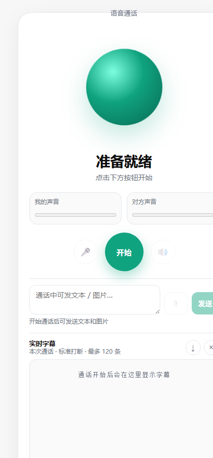

# chatgpt-web-voice

[](https://voice.peekcart.com/)
[](LICENSE)
[](https://www.python.org/)
[](https://fastapi.tiangolo.com/)

Reverse-engineered **ChatGPT.com Web Voice** (`/realtime/wm` + WebRTC + DataChannel) gateway.

Use a normal ChatGPT **web free-account** `access_token` to drive live voice calls from your own frontend/domain — no official Realtime API key required for this web path.

> Browser terminates WebRTC media. Server only: account pool, SDP proxy to `chatgpt.com/realtime/wm`, image upload for in-call `relay_message`, session binding.

## Live demo

- **Product**: https://voice.peekcart.com/
- **Source**: this repository

<p align="center">
  
</p>

## One-command start

```bash
cp data/accounts.example.json data/accounts.json   # put web access_token
cp .env.example .env                               # set VOICE_AUTH_KEY
docker compose up --build
# open http://127.0.0.1:8000/voice.html
```

Without Docker:

```bash
python -m venv .venv
# Windows: .venv\Scriptsctivate
source .venv/bin/activate
pip install -r requirements.txt
cp data/accounts.example.json data/accounts.json
export VOICE_AUTH_KEY=change-me
uvicorn app.main:app --host 0.0.0.0 --port 8000
```

## Features

- Realtime voice call (`/realtime/wm` + WebRTC)
- In-call text via DataChannel `relay_message`
- In-call image via `/api/voice/upload-image` + `sediment://file_id`
- Auto barge-in interrupt (`action_request: stop_speaking`)
- Captions from `chat_message_delta`
- Voice session token binding (`voice_session_id`)
- In-call account failover: auto reconnect with another pool token when the active account dies or the call drops

## Topics

`chatgpt` `voice` `webrtc` `fastapi` `self-hosted` `realtime` `wingman` `datachannel`

## Architecture

```text
Browser (static/voice.html)
  mic + RTCPeerConnection + DataChannel(oai-events)
        |
        | /api/voice/session
        | /api/voice/upload-image
        v
Gateway (this repo)
  account pool + optional proxy + curl_cffi chrome TLS
        |
        v
chatgpt.com
  /realtime/wm + Azure WebRTC media + files upload
```

## API

| Method | Path | Description |
|---|---|---|
| GET | `/api/voice/health` | health |
| POST | `/api/voice/session` | offer SDP to answer SDP |
| POST | `/api/voice/upload-image` | upload image, return `file_id` |
| POST | `/api/voice/session/release` | unbind voice session |

```http
Authorization: Bearer <VOICE_AUTH_KEY>
```

## In-call protocol

Envelope:

```json
{ "type": "data_message", "data": "<json string>" }
```

Text:

```json
{
  "type": "relay_message",
  "payload": {
    "type": "relay_message",
    "message": {
      "id": "uuid",
      "author": { "role": "user" },
      "create_time": 1710000000.0,
      "content": { "content_type": "text", "parts": ["hello"] },
      "metadata": { "serialization_metadata": { "custom_symbol_offsets": [] } },
      "clientMetadata": { "isOptimistic": true }
    }
  }
}
```

Interrupt:

```json
{ "type": "action_request", "payload": { "action": "stop_speaking" } }
```

## Environment

| Env | Default | Meaning |
|---|---|---|
| `VOICE_AUTH_KEY` | `change-me` | gateway auth key |
| `VOICE_ACCOUNTS_FILE` | `./data/accounts.json` | account pool |
| `VOICE_HTTP_PROXY` | empty | optional egress proxy |
| `VOICE_SKIP_SSL_VERIFY` | `true` | skip TLS verify |
| `VOICE_IMPERSONATE` | `chrome136` | curl_cffi impersonate |

## Security

- Do not commit real `accounts.json` / tokens
- Frontend only holds gateway key, never OpenAI web token
- Use HTTPS in production

## Changelog

See [Releases](https://github.com/dyhhhhhh/chatgpt-web-voice/releases) (`v0.1.0`).

## License / disclaimer

MIT. Research / self-hosted gateway.  
Requires your own ChatGPT web login session token.  
Not affiliated with OpenAI. Follow OpenAI ToS and local laws.

## Links

- Live: https://voice.peekcart.com/
- Issues: https://github.com/dyhhhhhh/chatgpt-web-voice/issues
